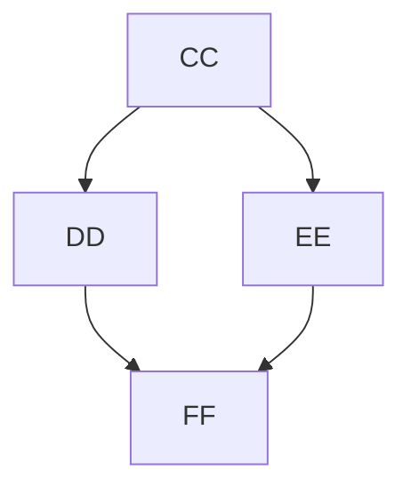

# Content

Adding a new content type is as simple as creating a new file in the `/src/pages/docs` directory. The file should be a 
markdown file with a `.mdx` extension.

You also need to register the new page/content in the `/src/config.ts` file. This is where the sidebar navigation is
configured.

---

## Components

Minimal docs support markdown and MDX. You can use markdown for simple content and MDX for more complex content that
requires React components.

### Heading

<SBS>
<div>
<Code>
```md
# Heading 1
## Heading 2
### Heading 3
#### Heading 4
##### Heading 5
###### Heading 6
```
</Code>
</div>
<div>
# Heading 1

<h2>
Heading 2
</h2>

<h3>
Heading 3
</h3>

#### Heading 4

##### Heading 5

###### Heading 6
</div>
</SBS>

<Alert>
`h2`, `h3` are automatically linked in the table of contents.
</Alert>

---

### Text

<SBS>
<div>
<Code>
```md
This is a paragraph.

This is another paragraph.

This is a paragraph with **bold** and *italic* text.

This is a paragraph with a [link](https://example.com).

Paragraph with a `code` block.

Autolink to https://example.com.

Strike through ~~text~~.
```
</Code>
</div>
<div>
This is a paragraph.

This is another paragraph.

This is a paragraph with **bold** and *italic* text.

This is a paragraph with a [link](https://example.com).

Paragraph with a `code` block.

Autolink to https://example.com.

Strike through ~~text~~.
</div>
</SBS>

---

### List

<SBS>
<div>
<Code>
```md
- Item 1
- Item 2
  - Item 2.1
  - Item 2.2

1. Item 1
2. Item 2
   1. Item 2.1
   2. Item 2.2

- [ ] Unchecked
- [x] Checked
```
</Code>
</div>
<div>
- Item 1
- Item 2
  - Item 2.1
  - Item 2.2

1. Item 1
2. Item 2
   1. Item 2.1
   2. Item 2.2

- [ ] Unchecked
- [x] Checked
</div>
</SBS>

---

### Blockquote

<SBS>
<div>
<Code>
```md
<BQ cite="- Goat">
  This is a blockquote.
</BQ>

<BQ>
  Another blockquote.
</BQ>
```
</Code>
</div>
<div>
<BQ cite="- Goat">
  This is a blockquote.
</BQ>

<BQ>
  Another blockquote wihout citation.
</BQ>
</div>
</SBS>

---

### Code

<SBS>
<div>
<CodeMM code={`
<Code>
  \`\`\`ts
    const foo = 'bar';
    console.log(foo);
  \`\`\`
</Code>

<CodeM fileNames={["One", "Two"]}>
  \`\`\`ts
    const foo = 'bar';
    console.log(foo);
  \`\`\`

  \`\`\`py
    foo = 'bar'
    print(foo)
  \`\`\`
</CodeM>

<CodeM fileNames={["Big"]} exp>
  \`\`\`py
    goat = 'big'
    print(goat)

    goat = 'small'
    print(goat)

    goat = 'medium'
    print(goat)

    goat = 'big'
    print(goat)
  \`\`\`
</CodeM>
`} language="tsx" />
</div>
<div>
#### Single code block

<Code>
```ts
const foo = 'bar';
console.log(foo);
```
</Code>

#### Multiple code blocks

<CodeM fileNames={["One", "Two"]}>
```ts
const foo = 'bar';
console.log(foo);
```
```py
  foo = 'bar'
  print(foo)
```
</CodeM>

#### Code with expandable content

<CodeM fileNames={["Big"]} exp>
```py
goat = 'big'
print(goat)

goat = 'small'
print(goat)

goat = 'medium'
print(goat)

goat = 'big'
print(goat)
```
</CodeM>
</div>
</SBS>

---

### Table

<SBS>
<div>
<Code>
```md
| Header 1 | Header 2 | Header 3 |
| :-:      | :-:      | :-:      |
| Cell 1   | Cell 2   | Cell 3   |
| Cell 4   | Cell 5   | Cell 6   |
```
</Code>
</div>
<div>
| Header 1 | Header 2 | Header 3 |
| :-:      | :-:      | :-:      |
| Cell 1   | Cell 2   | Cell 3   |
| Cell 4   | Cell 5   | Cell 6   |
</div>
</SBS>

---

### Image

<SBS>
<div>
<Code>
```md

```
</Code>
</div>
<div>

</div>
</SBS>

---

### Link

<SBS>
<div>
<Code>
```md
[External link](https://example.com)

[Interal link](/docs)
```
</Code>
</div>
<div>
[External link](https://example.com)

[Interal link](/docs)
</div>
</SBS>

<Alert>
  Links not starting with `/` are considered external links.
</Alert>

---

### Alert

<SBS>
<div>
<Code>
```tsx
<Alert>
  This is an alert.
</Alert>

<Alert title="Goat">
  This is an alert with a title.
</Alert>
```
</Code>
</div>
<div>
<Alert>
  This is an alert.
</Alert>

<Alert title="Goat">
  This is an alert with a title.
</Alert>
</div>
</SBS>

---

### Collapse

<SBS>
<div>
<Code>
```tsx
<Cola title="Collapse">
  You can collapse this content.
</Cola>
```
</Code>
</div>
<div>
<Cola title="Collapse">
  You can collapse this content.
</Cola>
</div>
</SBS>

---

### Tabs

<SBS>
<div>
<Code>
```tsx
<Tab title={["Goat", "Sheeple"]}>
  <div>
    Flying goat
  </div>
  <div>
    Sheeple goat
  </div>
</Tab>
```
</Code>
</div>
<div>
<Tab title={["Goat", "Sheeple"]}>
  <div>
    Flying goat
  </div>
  <div>
    Sheeple goat
  </div>
</Tab>
</div>
</SBS>

---

### Diagram ( Mermaid )

<SBS>
<div>
<CodeMM language="md" code={`
<Mer>
\`\`\`mermaid
graph TD;
  A-->B;
  A-->C;
  B-->D;
  C-->D;
\`\`\`
</Mer>

<MerM title={["Goat", "Sheeple"]}>
\`\`\`mermaid
graph TD;
  A-->B;
  A-->C;
  B-->D;
  C-->D;
\`\`\`
\`\`\`mermaid
graph TD;
  CC-->DD;
  CC-->EE;
  DD-->FF;
  EE-->FF;
\`\`\`
</MerM>
`} />
</div>
<div>
<Mer>

</Mer>

<MerM title={["Goat", "Sheeple"]}>


</MerM>
</div>
</SBS>

---

### Chart


<SBS>
  <div><Code>
```tsx
<AreaChart
  h={300}
  data={[
    {
      date: 'Mar 22',
      Apples: 2890,
      Oranges: 2338,
      Tomatoes: 2452,
    },
    {
      date: 'Mar 23',
      Apples: 2756,
      Oranges: 2103,
      Tomatoes: 2402,
    },
    {
      date: 'Mar 24',
      Apples: 3322,
      Oranges: 986,
      Tomatoes: 1821,
    },
    {
      date: 'Mar 25',
      Apples: 3470,
      Oranges: 2108,
      Tomatoes: 2809,
    },
    {
      date: 'Mar 26',
      Apples: 3129,
      Oranges: 1726,
      Tomatoes: 2290,
    },
  ]}
  dataKey="date"
  series={[
    { name: 'Apples', color: 'indigo.6' },
    { name: 'Oranges', color: 'blue.6' },
    { name: 'Tomatoes', color: 'teal.6' },
  ]}
  curveType="linear"
/>
```
</Code>
  </div>
  <div>
    <AreaChart
      h={300}
      data={[
        {
          date: 'Mar 22',
          Apples: 2890,
          Oranges: 2338,
          Tomatoes: 2452,
        },
        {
          date: 'Mar 23',
          Apples: 2756,
          Oranges: 2103,
          Tomatoes: 2402,
        },
        {
          date: 'Mar 24',
          Apples: 3322,
          Oranges: 986,
          Tomatoes: 1821,
        },
        {
          date: 'Mar 25',
          Apples: 3470,
          Oranges: 2108,
          Tomatoes: 2809,
        },
        {
          date: 'Mar 26',
          Apples: 3129,
          Oranges: 1726,
          Tomatoes: 2290,
        },
      ]}
      dataKey="date"
      series={[
        { name: 'Apples', color: 'indigo.6' },
        { name: 'Oranges', color: 'blue.6' },
        { name: 'Tomatoes', color: 'teal.6' },
      ]}
      curveType="linear"
    />
  </div>
</SBS>

For more details on the chart component, check the [Mantine Charts](https://mantine.dev/charts/area-chart/) page.

---

### Custom components

Adding Custom Components is as simple as creating a new file in the `/src/components/mdx` directory and
then importing it in the `/src/mdx-components.tsx` file.

Here is an example of a custom component:

<Code>
```tsx
import { ReactNode } from 'react';
import { MDXErrorBlock } from './error-block';
import { Accordion, Stack } from '@mantine/core';

interface MDXCollapseProps {
  children: ReactNode;
  title: string;
}

export const MDXCollapse = (props: MDXCollapseProps) => {
  if (!props.title) {
    return (
      <MDXErrorBlock
        error={{
          message: 'Title is missing',
          component: 'Cola',
        }}
      />
    );
  }

  return (
    <>
      <Accordion variant="contained">
        <Accordion.Item value={props.title} key={props.title}>
          <Accordion.Control>{props.title}</Accordion.Control>
          <Accordion.Panel px="xl" py="xs">
            <Stack>{props.children}</Stack>
          </Accordion.Panel>
        </Accordion.Item>
      </Accordion>
    </>
  );
};
```
</Code>